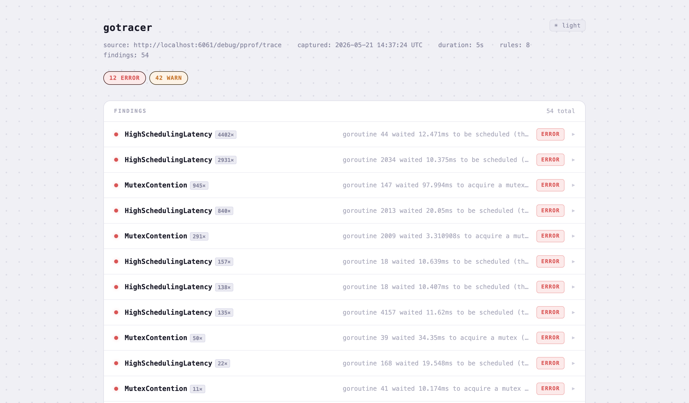

# gotracer

[](https://github.com/bright98/gotracer/actions/workflows/ci.yml)

`go tool trace` shows you a browser UI. gotracer gives you structured findings you can act on — in the terminal, in CI, or as an HTML report.

```
$ gotracer analyze ./trace.out

SEVERITY  RULE                   TIMESTAMP  MESSAGE
--------  ----                   ---------  -------
ERROR     GCPauseSpike           1.204s     GC pause of 45ms exceeds Error threshold (20ms)
WARN      ProcessorStarvation    850ms      P 2 was idle for 12ms (threshold: 10ms)
WARN      HighSchedulingLatency  300ms      goroutine 42 waited 18ms to be scheduled
```

## Report

The HTML report (`--format html`) is self-contained with dark and light themes:



Each row is expandable — click to see detail, fix suggestion, goroutine ID, and stack trace.

## Install

```
go install github.com/bright98/gotracer/cmd/gotracer@latest
```

Requires Go 1.22 or later (uses the `golang.org/x/exp/trace` structured trace reader).

```
$ gotracer --version
gotracer version v0.1.0
```

## Commands

### `analyze` — analyze a trace file

```
gotracer analyze <file> [--format human|json|html] [--output <file>] [--top N]
```

Reads a Go execution trace from disk, runs all rules, and prints findings to stdout.
With `--format html`, writes a self-contained HTML report to a file instead.

```bash
# capture a trace from your running service, then analyze it
curl -o trace.out "http://localhost:6060/debug/pprof/trace?seconds=5"
gotracer analyze trace.out

# machine-readable output for scripts or CI
gotracer analyze trace.out --format json

# HTML report — auto-generates gotracer_<timestamp>.html, prints path to stdout
gotracer analyze trace.out --format html

# HTML report to a specific file, open immediately
open $(gotracer analyze trace.out --format html --output report.html)

# show only the 3 worst findings per rule (useful when one rule fires hundreds of times)
gotracer analyze trace.out --top 3
```

### `capture` — capture and analyze in one step

```
gotracer capture --url <pprof-url> [--duration 5s] [--format html|json] [--output report.html] [--top N]
```

Connects to a live service's `/debug/pprof/trace` endpoint, captures a trace for the requested duration, runs all rules, and writes a report.

```bash
gotracer capture --url http://localhost:6060/debug/pprof/trace --duration 10s
# capturing trace from http://localhost:6060/debug/pprof/trace for 10s...
# gotracer_20260520_140205.html

# open the report
open $(gotracer capture --url http://localhost:6060/debug/pprof/trace)
```

The HTML report is self-contained — no server needed, open it directly in a browser.

Your service needs `net/http/pprof` registered:

```go
import _ "net/http/pprof"
```

## Exit codes

| Code | Meaning |
|------|---------|
| 0 | No findings, or Info-only |
| 1 | At least one Warn or Error finding |
| 2 | Could not read or parse the trace |

Exit code 1 makes CI gates straightforward:

```yaml
- run: gotracer analyze trace.out
```

## Rules

| Rule | Detects | Default thresholds |
|------|---------|-------------------|
| [`GCPauseSpike`](docs/rules/GCPauseSpike.md) | Stop-the-world GC pauses longer than expected | Warn 5ms · Error 20ms |
| [`HighSchedulingLatency`](docs/rules/HighSchedulingLatency.md) | Goroutines waiting too long in the run queue | Warn 1ms · Error 10ms |
| [`BlockedOnSyscall`](docs/rules/BlockedOnSyscall.md) | Goroutines stuck in a syscall for too long | Warn 10ms · Error 100ms |
| [`MutexContention`](docs/rules/MutexContention.md) | Long waits on sync.Mutex / RWMutex / WaitGroup | Warn 1ms · Error 10ms |
| [`GoroutineLeakGrowth`](docs/rules/GoroutineLeakGrowth.md) | Net goroutine count growing across the trace window | Warn +100 or 25% · Error +500 or 100% |
| [`HeapGrowthSpike`](docs/rules/HeapGrowthSpike.md) | Heap growing too fast (absolute or rate) | Warn 100 MB or 50 MB/s · Error 500 MB or 200 MB/s |
| [`ProcessorStarvation`](docs/rules/ProcessorStarvation.md) | Processors (Ps) sitting idle while work exists | Warn 10ms · Error 100ms |
| [`GCAssist`](docs/rules/GCAssist.md) | Goroutines blocking while waiting to do GC mark work | Warn 1ms · Error 10ms |

Each rule's thresholds are configurable when using gotracer as a library.

## How to capture a trace

**From a running service** (pprof endpoint):
```bash
curl -o trace.out "http://localhost:6060/debug/pprof/trace?seconds=5"
```

**From a Go test or benchmark:**
```go
f, _ := os.Create("trace.out")
trace.Start(f)
// ... code under test ...
trace.Stop()
```

**From a test binary:**
```bash
go test -trace trace.out ./...
```

## Sample output

[`examples/`](examples/) contains sample output generated from a live trace with synthetic workloads:

- [`e2e_findings.json`](examples/e2e_findings.json) — JSON output (`--format json`)
- [`e2e_report.html`](examples/e2e_report.html) — HTML report (`--format html`)

To regenerate them from a fresh trace:

```bash
go run ./e2e
```

Each rule's doc covers the runtime concept behind it, how the rule works, and what to do when you see a finding.
